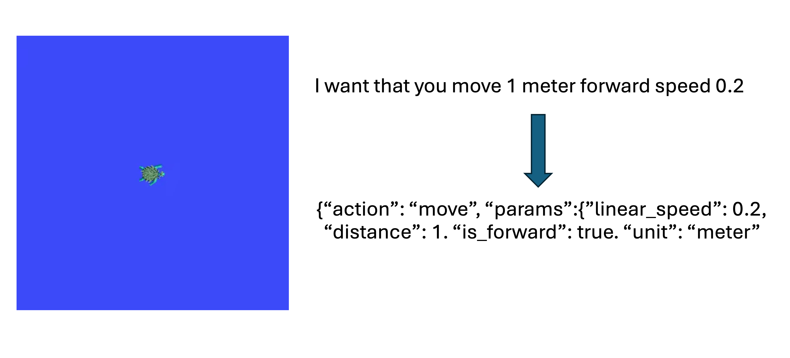

**Use LLM to understand user input and control the robot under ROS**

Kevin Stark 高梦扬

2024/05/06

[toc]

# Introduction

As robot technology becomes widely applied, simplifying human-robot interaction has become a hot topic for research. Traditional robot operation interfaces (such as CNC machines in factories and large robotic arms on assembly lines) usually require users to have professional programming knowledge and skills (such as writing Gcode and PLC programming), which limits the use by non-professionals.    

To address this issue, we propose **a human-robot interaction system that controls robot movement using a large language model (LLM) within the Robot Operating System (ROS)**.** This system achieves intuitive control of the robot, reducing the barrier to entry, allowing ordinary users to interact with robots more easily and naturally.  
We all know that controlling robots is a very important matter. In many courses on the theory of robotics, we have learned many core knowledge of robot motion control, including many concepts and methods in kinematics and dynamics, such as forward kinematics solution, inverse kinematics solution, Cartesian coordinate transformation, and so on. These knowledge are crucial for robot operation, but they are often too complex for non-professionals to master.  
The process for a robot to complete a task is roughly as follows:  

1. Connect the planning group required for control

2. Set the target pose (joint space or Cartesian space)
3. set motion constraints and path constraints,
4. Use motion solvers and planners (such as the Moveit framework) to plan a feasible motion path 
5. Execute.  

There are already many mature kinematics solvers. However, it is still a challenging task to define a task and to decompose a task into instructions chains that programs/agents/robots can execute or target coordinates and poses, so that the next solver/planner can calculate and plan.  
**This project takes the classic small turtle in ROS, `turtlesim`, as an example.  Implements the use of a LLM to understand user input and convert it into turtlesim node operation instructions in ROS.**  

Under the ROS, this project combines the rapidly developing technology related to LLM with robot body control, enabling the robot to better understand human instructions and requirements, reducing the barrier to human-robot interaction, and expanding the types of tasks that robots can perform.  
This project is a small attempt, and we believe that through this approach, users can interact with robots more easily, thus expanding the application scope of robot technology.


# Toolbox and Software

System: 

* Ubuntu 22.04

ROS: 

* ROS 2 Humble

LLM: 

* A: Commercial LLM, like ChatGPT
* B: Open-Source LLM, like Llama3 (optional)
* Use Ollama to bulid a Local LLM environment, use LiteLLM to provide API.

# Getting Start

## 1. Clone the repo to local computer

```sh
git clone https://github.com/ksdreamer/LLM-Robot.git
```

## 2. Environment setup

1. Add OpenAI API (or local large language model API, please refer to the “LLM” section for details)

```
echo 'export OPENAI_API_KEY=<put_your_api_key_here>' >> ~/.bashrc
```

2. For ROS2 Humble version (Ubuntu 22.04), you need to downgrade setuptools to the specified version (58.0.2)

```
pip3 install --upgrade setuptools==58.0.2
```

3. Install Python dependencies

```
	pip3 install -r requirements.txt
```

4. ROS uses colcon to build packages

```
colcon build --packages-select rosgpt
```

5. ROS source workspace

```
source install/setup.bash
```

## 3. Usage

We will use two functional packages: rosgpt and turtlesim.

Four nodes:

rosgpt has three: rosgpt, rosgptparser_turtlesim, rosgpt_client_node.

turtlesim has one: turtlesim_node.

Therefore, you need to open four terminals, which can be quickly created by pressing “ctrl+alt+t”.

Before running each node of the rosgpt package (1, 3, 4 below), you must enter the work directory and `source install/setup.bash`

* Run the ROSGPT Flask server

```sh
ros run rosgpt rosgpt
```

* Run the turtlesim node

``` sh
ros2 run turtlesim turtlesim_node
```

* Run rosgptparser_turtlesim.py

```sh
 ros2 run rosgpt rosgptparser_turtlesim
```

4. Run rosgpt_client_node.py

```sh
ros2 run rosgpt rosgpt_client_node
```

In the terminal of rosgpt_client_node, type English commands to the robot (can be personalized and colloquial).  For example, “ı want that you move 1 meter speed 0.8”.

# Formulation

The core logic of the system is divided into the following steps:

1. Users send control commands to the system through natural language (voice or text).
2. The system parses the command using a LLM with customized knowledge and converts it into ROS control code.
3. In ROS, each node executes the code to control the robot to perform corresponding actions.

# Methods

## LLM

The most important idea of this project is to use large language models such as ChatGPT-3.5 or Llama3. From the chatgpt_ros2_node node, according to certain requirements (Prompt, returning JSON format), convert user input, and then input it to the turtlesim_controller node.

### Prompt

                    ‘’‘Consider the following ontology:
                        {"action": "go_to_goal", "params": {"location": {"type": "str", "value": location}}}
                        {"action": "move", "params": {"linear_speed": linear_speed, "distance": distance, "is_forward": is_forward}}
                        {"action": "rotate", "params": {"angular_velocity": angular_velocity, "angle": angle, "is_clockwise": is_clockwise}}
                    You will be given human language prompts, and you need to return a JSON conformant to the ontology. Any action not in the ontology must be ignored. Here are some examples.
    
                    prompt: "Move forward for 1 meter at a speed of 0.5 meters per second."
                    returns: {"action": "move", "params": {"linear_speed": 0.5, "distance": 1, "is_forward": true, "unit": "meter"}}
    
                    prompt: "Rotate 60 degree in clockwise direction at 10 degrees per second and make pizza."
                    returns: {"action": "rotate", "params": {"angular_velocity": 10, "angle": 60, "is_clockwise": true, "unit": "degrees"}}
                    
                    prompt: "go to the bedroom, rotate 60 degrees and move 1 meter then stop"
                    returns: {"action": "sequence", "params": [{"action": "go_to_goal", "params": {"location": {"type": "str", "value": "bedroom"}}}, {"action": "rotate", "params": {"angular_velocity": 30, "angle": 60, "is_clockwise": false, "unit": "degrees"}}, {"action": "move", "params": {"linear_speed": 1, "distance": 1, "is_forward": true, "unit": "meter"}}, {"action": "stop"}]}
                    
                    '''

Because the length of the prompt is flexible, it needs to be split and then recombined. When the prompt is called with `prompt +=`, it will append the string on the right to the end of the prompt.
If the user input `text_command` is:
"Hey robot, please move 5 meters to the right and pick up the package on the table".
Then the returned JSON command will be:
{"command": "MOVE", "params": {"direction": "RIGHT", "distance": 5, "unit": "METERS", "pickup": true}}.
In fact, if there is no Persona or Embedding Vector, the node will return the `prompt + text_command` together to the LLM.

### Local LLM(Optional)

If you want to use the Local Open-Source LLM instead of Commercial ones:

To find and deploy the models, you can refer to [llama.cpp](https://github.com/ggerganov/llama.cpp) ,[ollama](https://ollama.com/) and [LMStudio](https://lmstudio.ai). 

To generate the API of local LLM, you can refer to [LiteLLM](https://www.litellm.ai)。

We use Ollama to deploy local LLM

```sh
curl -fsSL https://ollama.com/install.sh
```

Find the LLM that match your requirement from https://ollama.com/library , and type this: (we use llama3 as the Open-Source LLM)

```sh
ollama run llama3
```

Enter in terminal to install LiteLLM.

```sh
pip install litellm
```

## ROS Package and Node

RQT is shown below:


### rosgpt_client

in file: rosgpt_client_node.py

```python
class ROSGPTClient(Node):
    def __init__(self):
        super().__init__('rosgpt_client')
        self.declare_parameter('server_url', 'http://localhost:5000/rosgpt')
        self.server_url = self.get_parameter('server_url').value

        self.get_logger().info('ROSGPT client node started')

        self.send_text_command()

    def send_text_command(self): 
        while rclpy.ok():
            print('Enter a move command or a rotate command. The current ROSGPTParser of rosgpt_turtlesim does not multiple command. Will be extended later')
            text_command = input("Enter a text command: ")
            data = {'text_command': text_command}

            response = requests.post(self.server_url, data=data)

            if response.status_code == 200:
                try:
                    response_str = response.content.decode('utf-8')
                    response_dict = json.loads(response_str)

                    self.get_logger().info('Response: {}'.format(response_dict['text']))
                    self.get_logger().info('JSON: {}'.format(json.loads(response_dict['json'])))
                except Exception as e:
                    print('[Exception] An unexpected error occurred:', str(e)) 
            else:
                self.get_logger().error('Error: {}'.format(response.status_code))
```

Define a node rosgpt_client，it receives 'server_url'，and has a function 'send_text_command'

function'send_text_command' ask user to enter a command, then read it and send to ROSGPT service.

### chatgpt_ros2_node

in file: rosgpt.py

```python
class ROSGPTNode(Node):
    def __init__(self):
        """
        Initialize the ROSGPTNode class which is derived from the rclpy Node class.
        """
        # Call the superclass constructor and pass the name of the node
        super().__init__('chatgpt_ros2_node')\
        # Create a publisher for the 'voice_cmd' topic with a message queue size of 10
        self.publisher = self.create_publisher(String, 'voice_cmd', 10)

    def publish_message(self, message):
        """
        Publish the given message to the 'voice_cmd' topic.
        Args:
            message (str): The message to be published.
        """
        msg = String() # Create a new String message 
        msg.data = message # Convert the message to a JSON string and set the data field of the message
        self.publisher.publish(msg) # Publish the message using the publisher 
        #print('message Published: ', message) # Log the published message
        #print('msg.data Published: ', msg.data) # Log the published message
```

Define chatgpt_ros2_node，create a publisher，publish commands by topic 'voice_cmd' in JSON format.

### turtlesim_controller

The turtlesim_controller node is used to control the ROS turtlesim simulator. It receives commands from the `/voice_cmd` topic, parse these commands, and publish the parsed commands to the `/turtle1/cmd_vel` topic to control the movement of the turtlesim simulator. At the same time, it also subscribes to the `/turtle1/pose` topic to obtain the current position and orientation information of the turtlesim simulator.
1. The constructor function of the `__init__` class initializes the node and creates subscribers and publishers.
   - `self.create_subscription(String, '/voice_cmd', self.voice_cmd_callback, 10)`: This line of code creates a subscriber that subscribes to the topic named `/voice_cmd`, with the message type `String`. Whenever a new message is published to this topic, the `self.voice_cmd_callback` function will be called.
   - `self.velocity_publisher = self.create_publisher(Twist, '/turtle1/cmd_vel', 10)`: This line of code creates a publisher to publish `Twist` type messages to the topic `/turtle1/cmd_vel`.
   - `self.pose_subscriber = self.create_subscription(Pose, "/turtle1/pose", self.pose_callback, 10)`: This line of code creates a subscriber that subscribes to the topic named `/turtle1/pose`, with the message type `Pose`. Whenever a new message is published to this topic, the `self.pose_callback` function will be called.
   - `self.thread_executor = ThreadPoolExecutor(max_workers=1)` and `self.move_executor = SingleThreadedExecutor()`: These two lines of code create two executors, one is a thread pool executor, and the other is a single-threaded executor.
2. `pose_callback`: Callback function, which is called whenever there is a new message on the `/turtle1/pose` topic. It stores the x, y, and theta values from the message in the instance variables of the class.
3. `voice_cmd_callback`: Callback function, which is called whenever there is a new message on the `/voice_cmd` topic. It parses and converts the received JSON message into a ROS 2 command.

# Result and Disscusion

we send a message in terminal, asking it to move forward for 1 meter.  

The turtle simulator run as we want. 




# Conclusion

This project, which integrates a large language model (LLM) with the Robot Operating System (ROS) to control the movement of robots, holds potential significance. It has several key advantages and potential application scenarios:
1. **Reduced Operational Threshold**: By utilizing natural language processing technology, the project enables non-professional users to interact with robots more easily, thereby lowering the technical barrier to using robots.
2. **Enhanced User Experience**: The natural language interface offers a more intuitive and natural human-machine interaction, allowing users to communicate with robots more naturally.
3. **Improved Robot's Ability to Execute Complex Tasks and Application Range**: The capabilities of the LLM mean that the system can understand and execute more complex instructions, enhancing the robot's flexibility and adaptability.  

However, the project also faces some challenges and limitations:

1. **Technical Complexity**: Integrating LLM and ROS requires profound understanding in both fields. More fundamentally, it is the combination of AI and Robotics. A relatively cutting-edge direction in this area might be Reinforcement Learning on Robotics. This project is just a tiny scratch on the surface.
2. **Performance and Reliability**: The foundation of the LLM is the Transformer architecture, which is prone to hallucinations and forgetting. Accuracy may be affected by input data and context.
3. **Safety**: Ensuring the safety of the system and avoiding potential misoperations.

In future, might add these features:

* vision language model
* moveit 2 framework
* robot simulation like gazebo and webots, (and thesedays I am learning about the NVIDIA's Omniverse and Isaac Sim)

# References and Acknowledgment

In our project, we implemented a human-robot interaction system based on the ROSGPT package, developed by Anis Koubaa (2023). ROSGPT integrates the ChatGPT language model with the Robot Operating System (ROS) to enable natural language understanding and generation for robotic tasks. The project is available on github, [ROSGPT: ChatGPT Interface for ROS2 for Human-Robot Interaction](https://github.com/aniskoubaa/rosgptKoubaa), 

Koubaa, A. (2023). ROSGPT: Next-Generation Human-Robot Interaction with ChatGPT and ROS. Preprints.org, 2023, 2023040827. https://www.preprints.org/manuscript/202304.0827/v2. 


Tools we use:

[ROS 2 Documentation: Humble](https://docs.ros.org/en/humble/index.html)

[Ollama]( https://ollama.com)

[Litellm](https://docs.litellm.ai/docs)  


Other References:

https://github.com/NoneJou072/robochain

https://github.com/Auromix/ROS-LLM

https://github.com/GT-RIPL/Awesome-LLM-Robotics

[Python import openai library ImportError](https://stackoverflow.com/questions/71873182/no-module-named-openai)

[鱼香 ROS](https://fishros.com/d2lros2/)

[古月居·ROS2入门21讲](https://www.bilibili.com/video/BV16B4y1Q7jQ/)


